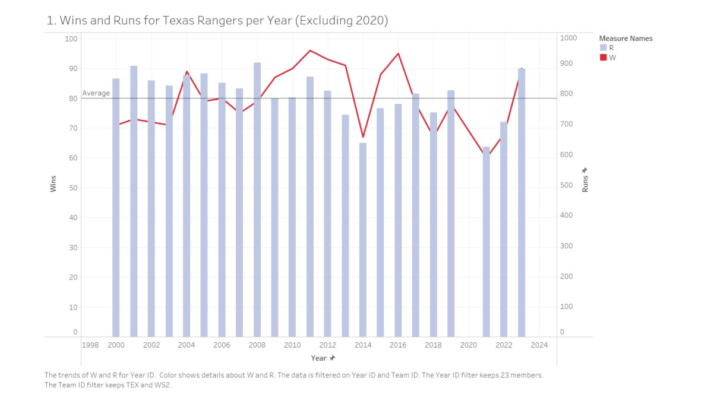
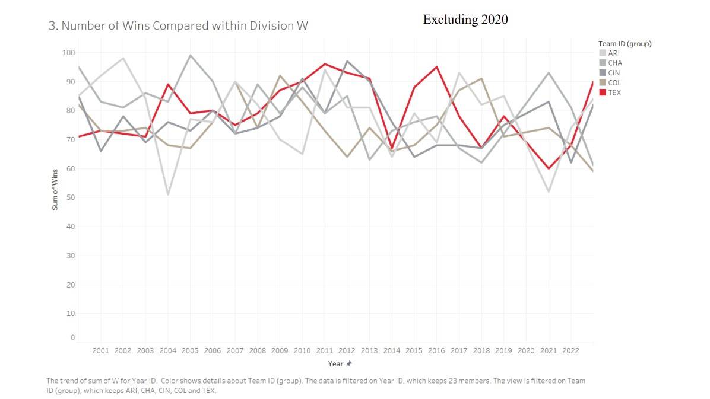
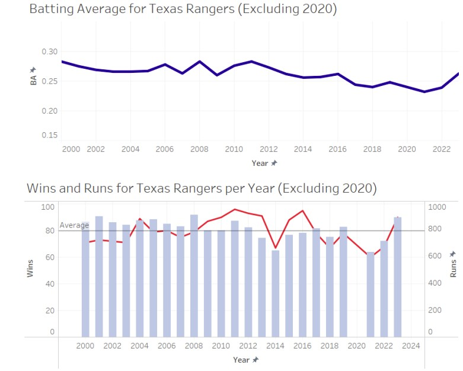

# SQL Baseball Analysis: Texas Rangers Attendance & Performance (1961–2023)

This project analyzes historical baseball data, focusing on the Texas Rangers’ performance, player salaries, and fan attendance from 1961 to 2023 using SQL. It explores trends between team success and attendance, salary extremes, and more.

## Objectives

- Compare Rangers attendance to league-wide ballpark attendance
- Identify seasons with salary extremes (Min/Max paid players)
- Measure year-over-year fan engagement (e.g. fans per win)
- Visualize long-term trends in ballpark usage, performance, and salaries

## Data Sources

- `homegames.csv`: Game-level attendance data across parks
- `parks.csv`: Parknames and location
- `salaries.csv`: Player salary data by year
- `people.csv`: Player name data
- `teams.csv`: Seasonal performance (Wins, DivWins, WSWin, etc.)

## Tools Used

- SQL (via SQLite in Python)
- Python 
- Kaggle Notebook
- PowerPoint (for visualizations)

## Key SQL Queries

The `sql-baseball-analysis.ipynb` notebook includes:
- Team success at major events
- Highest-paid and lowest-paid players per season
- Rangers wins vs. attendance over time
- Fans-per-win ratio

## Visualizations 

The `tableauBaseballVisualizations.pptx` file includes:
- Wins and runs for the team per year
    
- Win comparison within the division
    
- Batting average, wins, and runs dashboard
    

Other visuals included:
- Batting average trends
- Salary distribution box plots
  
## Key Insights

-  Between 2000 and 2023, the Rangers earned:
   - 2 Wild Card wins
   - 4 Division titles
   - 3 League wins
   - 1 World Series championship
- The team ranked 1st in its division **four times** between 2000–2023
- The **highest-attended** Rangers game season occurred in **2012**, with **3,460,280** total fans at Rangers Ballpark in Arlington, TX
- The team played **51 total home games** between 1969–2023

## Next Steps

- Integrate playoff appearance data for deeper context
- Expand beyond home games to analyze full-season performance
- Analyze visiting team impact on Rangers attendance
- Build dynamic Tableau dashboards with filters by year, team, and stadium

## Acknowledgements
- Arpan Gupta Data Scientist, IITian on Youtube for a very helpful SQL queries in Kaggle tutorial
- Professor Schneider at Arizona State University for the initial assignment, data, and encouragement
